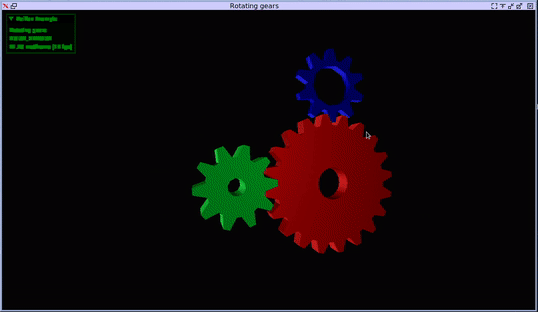

## Toy software Vulkan driver


## Run tests
```console
cd vulkenstein
python3 tests/run_all_tests.py
```

## Build
### LLVM Version: 11.* commit 0d3149f43173967d6f4e4c5c904a05e1022071d4
* Used for JIT code generation
### Vulkan SDK: 1.2.135.0
* Used for headers, spirv disassembly
### LibPFC
```console
cd 3rdparty/libpfc
make
su
echo 0 > /proc/sys/kernel/nmi_watchdog
echo 2 > /sys/bus/event_source/devices/cpu/rdpmc
insmod pfc.ko
```
### Vulkenstein
```console
mkdir build && cd build
cmake -DCMAKE_BUILD_TYPE=Debug -DCMAKE_C_COMPILER=clang -DCMAKE_CXX_COMPILER=clang++ -DCMAKE_EXPORT_COMPILE_COMMANDS=1 .. && make
```

## Reference

* [Whole-Function Vectorization](https://pdfs.semanticscholar.org/b01e/d17d21d9c69b60aa3e5018358e14b5e30b6e.pdf)

* [Introducing Control Flow into Vectorized Code](https://dl.acm.org/doi/pdf/10.5555/1299042.1299055?download=true)

* Aart J. C. Bik. The Software Vectorization Handbook. Intel Press, 2004.

* Automatic SIMD Vectorization of SSA-based Control Flow Graphs

* [Loops: Presentation](https://pdfs.semanticscholar.org/6dd6/cb34570c33e0cd456352aaed4a65659801d2.pdf)

* [CS447:CodeOptimization](https://www.csd.uwo.ca/~mmorenom/CS447/Lectures/CodeOptimization.html/node6.html)

* [EECS 583 – Class 2 Control Flow Analysis LLVM Introduction](http://www.eecs.umich.edu/courses/eecs583/slides/Lecture2.pdf)
