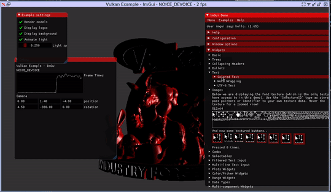

## Toy software Vulkan driver



## Features
* Naive software rasterization
  * Tiled
  * Triangles
* Spirv compilation on CPU
  * Packetization(multiple instances compiled into one kernel)
    * SIMD1/SIMD4/SIMD64
    * Control flow vectorization
  * Vertex shaders
    * Minimal viable
  * Pixel shaders
    * Minimal viable
* 2D Texture sampling
  * Only nearest neighbor
* Read/write 1D buffers

## TODO
* Software rasterization
  * Lines
  * AVX2
    * Experiment with int16 fixed point
  * Multi-threading
* Spirv compilation on CPU
    * Optimizations
      * Tune for AVX2
      * Data transformation AOS->AOSOA
  * Vertex shaders
    * Clipping distance
  * Pixel shaders
    * Discards
    * Write depth
* 2D Texture sampling
  * Implicit Mip selection with derivatives
* Read/write 2D Textures

## Control flow vectorization

Came up with the following algorithm for starters. It's not super efficient but easy to implement.

1) Calculate dominator tree.
2) Split edges into forward/backward.
3) Sort CFG using topological partial ordering defined by forward edges. Prioritize children within the same strongly connected component.
4) Allocate a mask register per basic block(uint64_t).
5) Each basic block clears its mask register on exit.
6) Jumping on a basic block is setting bits for active lanes.
7) For each basic block create a dispatch node that jumps to the basic block if any mask bit set or to the next dispatch node otherwise.
That creates a 'dispatch chain' that skips basic blocks with all mask bits clears.
8) Conditional jumps are replaced with jumps to dispatch chains.
9) Back edges are unconditional jumps to the loop header

### Example

HLSL Source:
```c++
[[vk::binding(0, 0)]] RWBuffer <uint> g_buf_0;
[[vk::binding(1, 0)]] RWBuffer <uint> g_buf_1;

uint get_num(uint t) {
  if (t < 888) {
     while (true) {
       t = (t ^ (t << 1)) + 1;
       if ((t & 7) == 7)
         continue;
       t = t * (t - 1) + 1;
       if (t > 200)
         return t;
       if ((t & 8) != 0)
         break;
     }
    t = (t << 2) + 1;
    return t;
  } else {
    return t + t * t * t;
  }
}

[numthreads(4, 1, 1)]
void main(uint3 tid : SV_DispatchThreadID)
{
  g_buf_0[tid.x] = get_num(g_buf_1[tid.x]);
}
```

Initial SPIRV CFG:


Linearized CFG:


LLVM IR for SIMD4 mode:


## Run tests
```console
cd vulkenstein
python3 tests/run_all_tests.py
```

## Build
### LLVM Version: 11.* commit 0d3149f43173967d6f4e4c5c904a05e1022071d4
* Used for JIT code generation
### Vulkan SDK: 1.2.135.0
* Used for headers, spirv disassembly
### LibPFC
* Used for microbenchmarking on Linux
```console
cd 3rdparty/libpfc
make
su
echo 0 > /proc/sys/kernel/nmi_watchdog
echo 2 > /sys/bus/event_source/devices/cpu/rdpmc
insmod pfc.ko
```
### Vulkenstein
```console
mkdir build && cd build
cmake -DCMAKE_BUILD_TYPE=Debug -DCMAKE_C_COMPILER=clang -DCMAKE_CXX_COMPILER=clang++ -DCMAKE_EXPORT_COMPILE_COMMANDS=1 .. && make
```

## Reference

* [Whole-Function Vectorization](https://pdfs.semanticscholar.org/b01e/d17d21d9c69b60aa3e5018358e14b5e30b6e.pdf)

* [Introducing Control Flow into Vectorized Code](https://dl.acm.org/doi/pdf/10.5555/1299042.1299055?download=true)

* Aart J. C. Bik. The Software Vectorization Handbook. Intel Press, 2004.

* Automatic SIMD Vectorization of SSA-based Control Flow Graphs

* [Loops: Presentation](https://pdfs.semanticscholar.org/6dd6/cb34570c33e0cd456352aaed4a65659801d2.pdf)

* [CS447:CodeOptimization](https://www.csd.uwo.ca/~mmorenom/CS447/Lectures/CodeOptimization.html/node6.html)

* [EECS 583 – Class 2 Control Flow Analysis LLVM Introduction](http://www.eecs.umich.edu/courses/eecs583/slides/Lecture2.pdf)

* [Solving the structured control flow problem once and for all](https://medium.com/leaningtech/solving-the-structured-control-flow-problem-once-and-for-all-5123117b1ee2)

* [NIR Docs](https://people.freedesktop.org/~cwabbott0/nir-docs/control_flow.html)

* [Formalizing Structured Control Flow Graphs](https://pdfs.semanticscholar.org/e1d7/2c75a29c3976b24eafa2cd05a155d12f2170.pdf)
